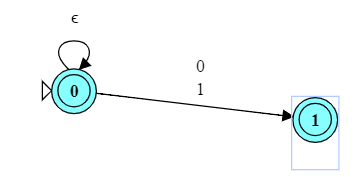

# Solution Notes

Notes on a problem solution may be written in Markdown notation
and will be included in the grade report.

* Graphics may be included, but must be given as a path relative to the problem directory.

    * Via markdown:

        

    * Direct inclusion

        